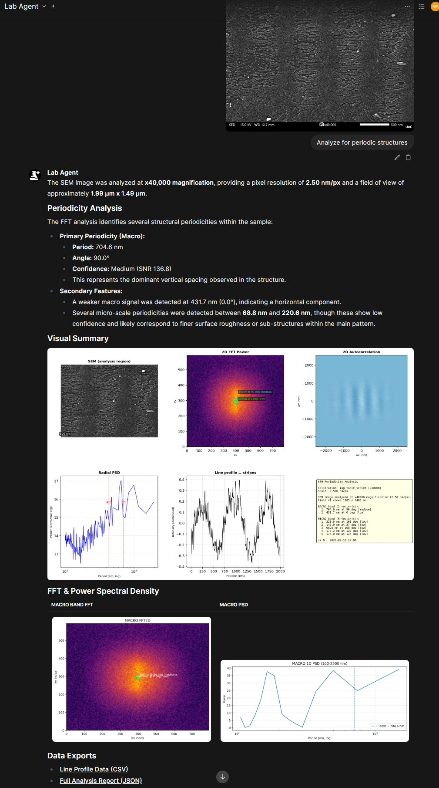

<table>
  <tr>
    <td width="150" align="center">
      
    </td>
    <td>
      <h1>Project FORTHought</h1>
      <i>A locally-hosted AI research configuration for Physics and STEM laboratories.</i>
      <br/><br/>
      <a href="https://github.com/MariosAdamidis/FORTHought/blob/main/LICENSE"></a>
      <a href="#"></a>
      <a href="#"></a>
      <br/>
    </td>
  </tr>
</table>

## What This Is

This repository documents my working configuration for a locally-hosted AI research platform, built around [Open WebUI](https://github.com/open-webui/open-webui), that I use daily in my Physics lab. It includes the custom tools, functions, optimizations, and MCP servers I've developed or assembled to support scientific workflows — literature review, spectroscopy, electron microscopy, X-ray diffraction, and data analysis.

**This is not a product.** It is a personal research setup that I maintain and iterate on. I upload my findings, configurations, and custom code here for documentation, reproducibility, and to share with my research group. The tools I build sit on top of existing open-source projects; my contribution is in how they are assembled, configured, and extended for real lab use.

**Hardware:**

| Server | CPU | GPU | Role |
|---|---|---|---|
| **Compute Server** (new) | AMD Ryzen 9 9950X | 2× AMD Radeon AI Pro R9700 (32 GB VRAM each) | OriginLab, Lemonade reranker, embeddings, VLM, LM Studio, Docling |
| **Docker Server** (existing) | Intel Xeon E5-2680 v4 | AMD Radeon RX 7900 XT (20 GB VRAM) | Open WebUI, MCP servers, Jupyter, Qdrant, MetaMCP, all Docker services |

The two machines communicate over Tailscale. The Docker server runs the full containerized stack, while the compute server handles GPU-intensive inference tasks (local LLMs, reranking, embeddings, document parsing).

> **Configuration note:** All service URLs default to `localhost`. To run your own instance, copy `config/.env.example` to `.env` and fill in your values. If you use Cloudflare Tunnels or a reverse proxy, update the relevant environment variables.

---

## Base Stack

The platform runs across two machines. The Docker server hosts the containerized stack, while the compute server handles GPU inference:

- **LLM inference** via [LM Studio](https://lmstudio.ai/) (local models on the compute server's dual R9700s) and cloud APIs (Gemini via Google research grant, OpenRouter as fallback)
- **Code execution** via a GPU-accelerated Jupyter kernel (ROCm, scientific Python stack)
- **Document parsing** via [Docling](https://github.com/docling-project/docling) (native PyTorch ROCm, with Qwen3-VL for figure descriptions)
- **Vector search** via [Qdrant](https://github.com/qdrant/qdrant) (hybrid BM25 + semantic)
- **Tool orchestration** via [MetaMCP](https://github.com/nicepkg/MetaMCP), which aggregates all my MCP servers behind a single HTTP endpoint

All services run on-premises. No data leaves the local network unless I explicitly use a cloud LLM.

---

## What I've Configured and Built

### RAG Pipeline Optimization

I tuned Open WebUI's RAG pipeline for scientific documents. Out-of-the-box defaults struggle with multi-column papers, equations, and dense tables. My current configuration:

| Stage | Configuration | Notes |
|---|---|---|
| **Parsing** | Docling (ROCm GPU) | Native PyTorch ROCm with Granite-Docling instances; VLM image description via Qwen3-VL |
| **Embeddings** | Qwen 0.6B embed via LM Studio | Served through a custom parallel proxy that splits OWUI's single-batch requests into concurrent sub-batches |
| **Vector store** | Qdrant, hybrid search enabled | 800-token chunks, 100 overlap |
| **Reranking** | BGE-reranker-v2-m3 (GGUF) on 🍋 AMD Lemonade Server | `/api/v1/reranking` endpoint, shared by RAG and web search |

The 🍋 [AMD Lemonade](https://github.com/lemonade-sdk/lemonade) Server is the reranking backbone — it serves the model through an OpenAI-compatible API, so both Open WebUI's native RAG and my custom web search tool use the same endpoint.

### Multi-Role Local Models on Lemonade

A core design principle is making each locally-hosted model serve multiple roles across the stack. The compute server runs three models on the dual R9700 GPUs through AMD Lemonade, and each one pulls double (or triple) duty:

| Model | Roles | Used by |
|---|---|---|
| **BGE-reranker-v2-m3** (GGUF) | RAG reranking, web search reranking | OWUI Documents pipeline, `web_search.py` tool |
| **Qwen3-Embedding-0.6B** (GGUF) | Document embeddings | OWUI RAG pipeline (via parallel proxy on :5555) |
| **Qwen3-VL-30B** (GGUF) | Image descriptions for Docling, vision model for SEM analysis, general-purpose VLM | Docling picture description, `image_description_context` filter, SEM MCP server, direct chat |

The VLM in particular is planned for browser-use automation — using it to control instrument software (e.g., navigating a microscope GUI, clicking "capture image") for end-to-end experimental workflows.

### Free Web Search with Reranking

I built a custom Open WebUI tool function that provides web-augmented answers without expensive search APIs:

- Queries the [LangSearch](https://langsearch.com/) API (free tier, 1000 calls/day)
- Passes all results through the same Lemonade reranker used by RAG
- Filters by relevance score (>= 1.0 raw logit), Latin-script ratio, and content length
- Auto-fetches top-scoring pages for full context
- Injects citations into OWUI's native citation UI

See: [`tools/web_search.py`](tools/web_search.py)

### Three Agent Profiles with Skill-Gated Routing

Instead of one system prompt stuffed with every tool's documentation, I split my setup into three profiles, each with its own tool surface:

| Profile | What I use it for | Tools it sees |
|---|---|---|
| **Lab** | Literature review, report writing, web research, chemistry lookups | `paper.*`, `file.*`, `web.*`, `chem.*`, `lib.*`, `slide.*`, Jupyter |
| **Coder** | Data analysis, plotting, scripting, library documentation | Jupyter (ROCm), `file.*`, `lib.*` |
| **Instrument** | Spectroscopy fitting, SEM analysis, XRD phase ID, PL modeling | `spec.*`, `micro.*`, `xrd.*`, `pl.*`, `file.*` |

Each profile consists of three pieces:
1. A **lean system prompt** ([`profiles/`](profiles/)) — contains only a routing table, no tool recipes
2. A **Skills file** ([`skills/`](skills/)) — a Python OWUI Tool that acts as the MCP gateway with typed public methods and a registry-based dispatch
3. **Skill documents** ([`skill-docs/`](skill-docs/)) — loaded on-demand via `view_skill(domain)` only when the LLM actually needs to call a tool

This keeps token usage low. The LLM never loads tool documentation it doesn't need for the current request.

### MetaMCP Orchestration

All tool servers connect through MetaMCP on a single port. Adding a new server is:

1. Write the MCP server
2. Add one entry to MetaMCP's config
3. Restart MetaMCP
4. Register the tool in the relevant Skills file
5. Write a skill document

This is how I've been able to add new scientific tools (XRD, PL, Chemistry) without disrupting the existing stack.

---

## Science Tools

These are the MCP tool servers I've built or significantly customized for my lab's workflows. Each runs as a standalone Python HTTP server implementing the MCP JSON-RPC protocol.

---

### OriginMCP — OriginLab Automation

**Server:** [`mcp-servers/origin/server.py`](mcp-servers/origin/server.py) (3300+ lines, 10 tools)

Automates OriginPro through its COM API, allowing the LLM to inspect, analyze, and fit spectroscopy data from OPJ project files without manual GUI interaction.

**What it does:**
- Inspect OPJ file structure and column metadata (including user-defined parameters like strain, polarization)
- Extract raw X/Y data from any workbook/sheet
- Fit peaks: single (Lorentzian, Gaussian, Voigt) or two-peak decomposition across all lineshape combinations
- Batch fit across N columns in one call with automatic summary grid, waterfall, and trend plots
- Detect degenerate fits (converging peaks) and flag them without crashing
- Infer experimental parameters from column naming conventions when metadata is missing

Runs natively on Windows (requires OriginPro installed). Accessible to the Docker stack via Tailscale.

---

### Papers MCP — Literature Search

**Server:** [`mcp-servers/papers/server.py`](mcp-servers/papers/server.py)

Searches and retrieves academic papers from multiple sources in a single tool call.

**What it does:**
- Search OpenAlex (250M+ papers, full-text semantic search), PubMed, and Semantic Scholar
- Author disambiguation via ORCID
- Full-text PDF download with automatic source fallback (publisher, OA location, arXiv)
- Batch operations for processing reference lists
- Returns structured metadata the LLM uses directly for citations

---

### XRD Server — X-Ray Diffraction Phase Identification

**Server:** [`mcp-servers/xrd/server.py`](mcp-servers/xrd/server.py)

A file-format-agnostic XRD analysis pipeline that identifies crystalline phases from raw diffraction data.

**What it does:**
- Parses `.xy`, `.dat`, `.csv`, `.brml` (Bruker XML), and `.raw` (Bruker RAW v4 binary) automatically
- Matches peaks against the Crystallography Open Database (COD) and Materials Project
- Reports confidence scores, Rwp R-factors, purity estimates, and impurity detection from precursor formulas
- Generates annotated pattern and comparison plots inline
- Exports Origin-ready CSVs (background-subtracted, with d-spacing and peak markers)
- Chains into OriginMCP to produce a ready-to-use OPJ project file

---

### SEM Micro — Electron Microscopy FFT Analysis

**Server:** [`mcp-servers/micro/server.py`](mcp-servers/micro/server.py)

FFT-based periodicity and particle size analysis for SEM images.

**What it does:**
- Reads magnification from the SEM info bar via VLM
- Performs 2D FFT with radial averaging and peak detection
- Reports periodicity (nm), orientation, confidence, and SNR for macro/micro spatial frequency bands
- Particle size distribution (count, mean diameter, std dev, p10-p90) when requested
- Outputs a 6-panel composite figure (FFT, power spectrum, line profiles, histogram)

<p align="center">
  
  <br/>
  <em>FFT periodicity analysis of a LIPSS nanostructure at ×40,000 — automatic magnification detection, 6-panel composite, and data export.</em>
</p>

> 📸 **More screenshots:** See the full **[Examples Gallery](docs/EXAMPLES.md)** for OriginMCP batch fitting, literature search, XRD phase ID, PL experiment planning, and more.

---

### PL Server — Photoluminescence Experiment Planning

**Server:** [`mcp-servers/pl/server.py`](mcp-servers/pl/server.py)

Laser/filter/optics recommender and Fresnel interference calculator for planning photoluminescence measurements, with specialized support for 2D materials.

**What it does:**
- Recommends laser wavelengths, filters, and optical components for any target material
- Calculates excitation and emission field enhancement factors for air/SiO₂/Si substrate stacks
- Models how PL, Raman, and SHG signal intensity varies with SiO₂ thickness
- Plans SHG/THG, strain analysis, PLE, imaging mode, and valley polarization experiments
- Built-in materials database (TMDs, perovskites, III-V semiconductors, etc.)

---

### Files MCP — Document Generation

**Server:** [`mcp-servers/files/`](mcp-servers/files/)

Generates DOCX, PPTX, XLSX, PDF, CSV, HTML, and plain text files from structured data, with default templates.

---

## Custom Open WebUI Functions

Beyond MCP tools, I use several custom OWUI functions uploaded directly into the platform:

### Pipes

| Function | What it does |
|---|---|
| [`gemini_pipe.py`](pipes/gemini_pipe.py) | Google Gemini pipeline with native tool support and image generation |
| [`openrouter_pipe_v2.py`](pipes/openrouter_pipe_v2.py) | OpenRouter Responses API integration with web search and file upload support |

### Filters

| Function | What it does |
|---|---|
| [`markdown_normalizer.py`](filters/markdown_normalizer.py) | Cleans leaked reasoning labels, XML artifacts, and broken formatting from LLM outputs |
| [`image_description_context.py`](filters/image_description_context.py) | Extracts text from images via a vision model so text-only models can process image uploads |
| [`image_reembed_injector.py`](filters/image_reembed_injector.py) | Re-injects uploaded image URLs into context for models that lose them across turns |
| [`uploaded_filename.py`](filters/uploaded_filename.py) | Injects file metadata (IDs, names) so tools can reference uploaded files |

### Tools

| Function | What it does |
|---|---|
| [`web_search.py`](tools/web_search.py) | Free web search with LangSearch API + Lemonade reranking |
| [`chemistry_database.py`](tools/chemistry_database.py) | PubChem and CAS compound lookups (name, formula, CAS number, safety data) |
| [`chart_server/`](tools/chart_server/) | Server-side Chart.js rendering for inline data visualizations |
| [`presenton_adapter.py`](tools/presenton_adapter.py) | MCP bridge to Presenton for AI-generated slide decks |

### Actions

| Function | What it does |
|---|---|
| [`export_to_word.py`](actions/export_to_word.py) | Export conversations to formatted Word documents with APA 7th styling |
| [`lemonade_control_panel.py`](actions/lemonade_control_panel.py) | Visual dashboard for monitoring the AMD Lemonade Server |

---

## Infrastructure Notes

### Reranker Configuration (Open WebUI Admin → Documents)

```
Reranking Engine: external
External Reranker URL: http://<host-ip>:8040/api/v1/reranking
Reranking Model: bge-reranker-v2-m3-GGUF
```

### Key Docker Environment Variables

See [`config/.env.example`](config/.env.example) for the full list. Key ones:

```yaml
- VECTOR_DB=qdrant
- QDRANT_URI=http://qdrant:6333
- RAG_EMBEDDING_ENGINE=openai
- RAG_EMBEDDING_MODEL=embed
- ENABLE_RAG_HYBRID_SEARCH=True
- CODE_EXECUTION_ENGINE=jupyter
- CODE_EXECUTION_JUPYTER_URL=http://unsloth-jupyter:8888
```

### Architecture Overview

```
┌─── Docker Server (Xeon E5-2680v4 + RX 7900 XT) ───────────┐
│                                                              │
│  Open WebUI (:8081)                                          │
│      │                                                       │
│      ├── Gemini Pipeline (primary LLM, research grant)       │
│      ├── OpenRouter Pipe (fallback models)                   │
│      │                                                       │
│      ├── Qdrant (:6333) ── hybrid vector search              │
│      ├── Jupyter (:8888) ── code execution (ROCm)            │
│      │                                                       │
│      └── MetaMCP (:12008)                                    │
│          ├── Papers    (:9005)   ├── Chemistry (OWUI tool)   │
│          ├── Files     (:9004)   ├── XRD       (:9008)       │
│          ├── SEM/Micro (:9006)   ├── PL        (:9010)       │
│          └── Context7, Presenton, Browser                    │
│                                                              │
└──────────────── Tailscale ──────────────────────────────────┘
                      │
┌─── Compute Server (Ryzen 9950X + 2× R9700 64 GB) ──────────┐
│                                                              │
│  LM Studio (:1234) ── local LLMs, VLM (Qwen3-VL)            │
│  Lemonade Server (:8040) ── BGE-reranker-v2-m3-GGUF          │
│  Embedding Proxy (:5555) ── Qwen 0.6B embed                  │
│  Docling (:5001-5003) ── document parsing (ROCm)             │
│  OriginMCP (:12009) ── OriginLab COM automation (Windows)    │
│                                                              │
└──────────────────────────────────────────────────────────────┘
```

---

## Repository Structure

```
FORTHought/
├── README.md
├── .gitignore
│
├── mcp-servers/                     # MCP tool servers
│   ├── papers/server.py             #   Literature search & download
│   ├── origin/server.py             #   OriginLab COM automation
│   ├── micro/server.py              #   SEM FFT periodicity analysis
│   ├── xrd/server.py                #   XRD phase identification
│   ├── pl/server.py                 #   PL experiment planning
│   └── files/                       #   Document generation (DOCX, PPTX, etc.)
│
├── pipes/                           # LLM provider integrations
│   ├── gemini_pipe.py               #   Google Gemini pipeline
│   └── openrouter_pipe_v2.py        #   OpenRouter Responses API
│
├── filters/                         # Input/output processing
│   ├── markdown_normalizer.py       #   Fix LLM formatting issues
│   ├── image_description_context.py #   Vision-to-text for non-vision models
│   ├── image_reembed_injector.py    #   Re-inject image URLs across turns
│   └── uploaded_filename.py         #   File metadata injection for tools
│
├── tools/                           # OWUI tool functions
│   ├── web_search.py                #   Free web search + reranking
│   ├── chemistry_database.py        #   PubChem/CAS compound lookups
│   ├── chart_server/                #   Chart.js rendering service
│   └── presenton_adapter.py         #   AI slide deck generation
│
├── actions/                         # Chat action buttons
│   ├── export_to_word.py            #   Conversation → Word doc
│   └── lemonade_control_panel.py    #   Lemonade server dashboard
│
├── skills/                          # MCP gateway + routing logic
│   ├── lab_skills.py                #   Lab profile tools
│   ├── coder_skills.py              #   Coder profile tools
│   └── instrument_skills.py         #   Instrument profile tools
│
├── skill-docs/                      # On-demand tool documentation
│   ├── instruments/{origin,sem,xrd}/
│   ├── research/{academic-search,literature,web-search}/
│   ├── documents/{file-export,presenton}/
│   ├── compute/code-interpreter/
│   └── visualization/chartjs/
│
├── profiles/                        # System prompts (lean routing tables)
│   ├── lab_prompt.md
│   ├── coder_prompt.md
│   └── instrument_prompt.md
│
├── config/
│   ├── docker-compose.yml           # Full stack deployment
│   ├── .env.example                 # All required environment variables
│   ├── Dockerfile.jupyter           # GPU Jupyter kernel (ROCm)
│   ├── Dockerfile.fileserver        # Authenticated file server
│   └── Dockerfile.metamcp           # MetaMCP container
│
├── docs/
│   ├── SETUP.md                     # Complete OWUI configuration guide
│   └── EXAMPLES.md                  # Screenshots gallery
│
├── scripts/
│   ├── fileserver_app.py            # File server application
│   └── smoke_test_core.sh           # Service health checks
│
└── assets/
    └── forthought-logo.png
```

---

## Getting Started

1. **Clone the repository:**
   ```bash
   git clone https://github.com/MariosAdamidis/FORTHought.git
   cd FORTHought
   ```

2. **Configure environment:**
   ```bash
   cp config/.env.example .env
   # Edit .env with your API keys and passwords
   ```

3. **Start the stack:**
   ```bash
   docker compose -f config/docker-compose.yml up -d
   ```

4. **Follow the setup guide:** See **[docs/SETUP.md](docs/SETUP.md)** for the complete walkthrough — importing functions, creating model profiles, configuring RAG, code execution, and MetaMCP wiring.

5. **Verify:** Run `bash scripts/smoke_test_core.sh` to check all services are healthy.

---

## Roadmap

### Done
- [x] HTTP-persistent MCP transport (eliminated cold starts)
- [x] Three agent profiles with skill-gated routing
- [x] OriginMCP: batch fitting, waterfall/trend plots, degenerate fit detection
- [x] XRD pipeline with COD/MP matching and Origin export
- [x] PL substrate enhancement and experiment planning server
- [x] Chemistry database integration
- [x] AMD Lemonade reranker (dual: RAG + web search)
- [x] Free web search tool with reranking
- [x] Parallel embedding proxy
- [x] Docling GPU acceleration on ROCm
- [x] Docling VLM integration (Qwen3-VL for figure descriptions during ingestion)
- [x] Markdown normalizer for output cleanup

### Next
- [ ] Browser-use VLM automation for instrument control (microscope GUI navigation, image capture)
- [ ] User-facing documentation
- [ ] N-peak fitting (defect emission, phonon replicas)
- [ ] Raman peak database
- [ ] PLE contour plots
- [ ] Full-loop: plan → measure → analyze → report

---

## Acknowledgements

This setup is built on top of open-source projects and community contributions I'm grateful for.

### Core Platform

- [Open WebUI](https://github.com/open-webui/open-webui) — The chat interface everything runs through
- [AMD Lemonade](https://github.com/lemonade-sdk/lemonade) — Local reranker serving on AMD hardware
- [Docling](https://github.com/docling-project/docling) — Document parsing for the RAG pipeline
- [Qdrant](https://github.com/qdrant/qdrant) — Vector database
- [LM Studio](https://lmstudio.ai/) — Local model serving
- [MetaMCP](https://github.com/nicepkg/MetaMCP) — MCP server orchestration
- [Crystallography Open Database](https://www.crystallography.net/) — XRD reference patterns
- [Materials Project](https://github.com/materialsproject) — Materials science database
- [LangSearch](https://langsearch.com/) — Free web search API

### Community Functions (adapted for FORTHought)

Several Open WebUI functions in this repository are adapted from community work. Original authors are credited in each file header.

| Function | Original Author | What I adapted |
|---|---|---|
| Gemini Pipeline | [owndev](https://openwebui.com/u/owndev), [olivier-lacroix](https://openwebui.com/u/olivier-lacroix) | Token optimization, tool integration, image generation |
| OpenRouter Pipe | [rbb-dev](https://openwebui.com/u/rbb-dev) | Integration with our MetaMCP and file server |
| Export to Word | [Fu-Jie](https://openwebui.com/u/Fu-Jie) | APA 7th Edition styling, Greek/English i18n |
| Markdown Normalizer | [Fu-Jie](https://openwebui.com/u/Fu-Jie) | Custom rules for scientific output cleanup |
| Image Description Context | [inMorphis](https://openwebui.com/u/inMorphis) | Adapted for our multi-model routing |
| Files Metadata Injector | [GlissemanTV](https://openwebui.com/u/GlissemanTV) | Integration with our file server pipeline |
| Lemonade Control Panel | [Sawan Srivastava](https://openwebui.com/u/sawan-srivastava) | Integrated into our Lemonade deployment |

### Community Contributors

- **r/LocalLLaMA** contributor **Ok_Ocelot2268** — ROCm patches for Unsloth
- **@mballesterosc** (Open WebUI community) — File Path Injector concept

---

## License

MIT License. See [LICENSE](LICENSE) for details.
