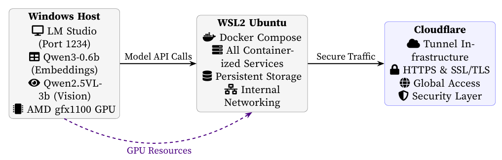

<table>
  <tr>
    <td width="150" align="center">
      
    </td>
    <td>
      <h1> Project FORTHought </h1>
      <i>The Open-Source Operating System for AI-Powered Research.</i>
      <br/><br/>
      <a href="https://github.com/MariosAdamidis/FORTHought/blob/main/LICENSE"></a>
      <a href="#-roadmap"></a>
      <a href="#-contributing"></a>
      <br/>
    </td>
  </tr>
</table>

## About The Project

Scientific progress is often bottlenecked by the challenge of navigating and integrating vast, disparate sources of information. Researchers face a deluge of data from papers, experiments, and databases, with limited tools to synthesize it effectively.

**Project FORTHought** aims to solve this by providing a blueprint for a fully-featured, locally-hosted AI research ecosystem. It's designed to be a versatile and powerful "lab-in-a-box" that any researcher or developer can deploy to supercharge their workflow.

This platform is more than just a collection of tools; it's a foundation for creating a domain-specific **"AI Research Associate."** The long-term vision is to establish a pipeline that can:

1.  **Ingest** heterogeneous lab data (notes, instrument outputs, messy spreadsheets, PDFs).
2.  **Structure** this data into high-quality, queryable knowledge bases and fine-tuning datasets.
3.  **Fine-tune** specialized, efficient models that possess a deep, nuanced understanding of a specific research domain.
4.  **Collaborate** with researchers on complex, end-to-end tasks—from hypothesis generation to data analysis and reporting.

This repository provides the foundational layer: a robust, stable, and highly capable platform ready for you to build upon.

> **Note for AMD GPU Users:** A key contribution of this project is its pre-configured support for **AMD ROCm**. The Jupyter/Unsloth `Dockerfile` is designed to work out-of-the-box on compatible AMD hardware, saving you the significant effort typically required to set up this stack.

## Core Capabilities

*  **Self-Correcting Code Interpreter**: A robust agent that can write, execute, and *autonomously debug* Python code in a persistent, GPU-accelerated Jupyter environment. It's guided by a sophisticated system prompt and comes equipped with a vast academic library stack.
*  **Hybrid Document Intelligence**: A complete, local RAG pipeline for documents and images. It uses `Docling` for parsing, a local VLM for image analysis, and a local model for embeddings, ensuring both high performance and data privacy.
*  **Extensible Scientific Tooling**: Connects to external scientific databases via the Model Context Protocol (MCP). Includes a working integration with **Materials Project** for direct querying of materials science data.
*  **Private & Integrated Web Search**: A self-hosted **SearXNG** instance provides privacy-focused web search, fully integrated into the RAG workflow to provide up-to-date information to the models.
*  **Advanced Visualization & File Handling**: Generate plots and data files within the Code Interpreter and receive public-facing download links for easy sharing and collaboration.

## 🏗️ System Architecture

The platform is composed of several containerized services that work in concert, orchestrated by Docker Compose. The diagram below illustrates the high-level data and request flow, from the user interface to the backend services and external APIs.



##  Getting Started

Follow these steps to get your own instance of Project FORTHought running.

### Prerequisites

*   [Docker](https://www.docker.com/products/docker-desktop/) and Docker Compose
*   [Git](https://git-scm.com/)
*   A running LLM inference server (e.g., [LM Studio](https://lmstudio.ai/), [Ollama](https://ollama.com/)) that provides an OpenAI-compatible API endpoint.
*   For GPU acceleration in the Code Interpreter on Windows, a system with WSL2 and a compatible GPU (NVIDIA/CUDA or AMD/ROCm) is required.

### Installation

1.  **Clone the repository:**
    ```sh
    git clone https://github.com/MariosAdamidis/FORTHought.git
    cd FORTHought
    ```

2.  **Configure your environment:**
    *   Create a `.env` file by copying the example template. This file will hold your secrets and is ignored by Git.
        ```sh
        cp .env.example .env
        ```
    *   Edit the `.env` file with a text editor and fill in the required values, such as your **Materials Project API Key** and the password for the Jupyter server.

3.  **Launch the platform:**
    ```sh
    docker compose up -d
    ```
    This command will build the custom images and start all the services in the background. The first launch may take some time.

4.  **Perform Initial Setup in Open WebUI:**
    *   Access the platform at `http://localhost:8081`. Create your local admin account.
    *   **Connect to your LLM:** Go to `Settings -> Models` and configure the connection to your LLM inference server.
    *   **Install the Critical File Path Filter:** To enable file analysis with the Code Interpreter, you **must** install a special message filter. Follow the detailed instructions in the [**Enabling File Access**](#-enabling-file-access-in-the-code-interpreter) section below.
    *   **Enable MCP Tools:** Go to `Settings -> Tools` and add the endpoints for the pre-configured tools. See the [**Extending with MCP Tools**](#-extending-the-platform-with-mcp-tools) section for details.

## Configuration & Customization

This section contains the detailed settings and prompts used in this project to ensure exact reproducibility.

### LM Studio Configuration
These settings are crucial for replicating the performance and behavior of the models.

#### VLM Model (`qwen-2.5vl-3b`) Settings
Used for generating image descriptions in the RAG pipeline.
*   **Context Length:** `4096`
*   **GPU Offload:** Max (e.g., `36/36` layers)
*   **Offload KV Cache:** Enabled
*   **Flash Attention:** Enabled
*   **Cache Quantization:** `Q8_0`
*   **Temperature:** `0.01`
*   **Top K Sampling:** `40`
*   **Repeat Penalty:** `1.05`
*   **Min P Sampling:** `0.05`
*   **Top P Sampling:** `0.01`

#### Embedding Model (`text-embedding-qwen`) Settings
Used for creating vector embeddings for RAG.
*   **Context Length:** `8192`
*   **GPU Offload:** Max (e.g., `28/28` layers)

### System Prompts
The behavior of the AI is controlled by powerful system prompts. You can edit these in `Admin Settings` in Open WebUI.

<details>
<summary><strong>Click to expand the Code Interpreter System Prompt</strong></summary>

```text
#### 🔬 Code Interpreter Agent

### 🚨 CRITICAL: HIDDEN REASONING + SINGLE ROBUST CODE BLOCK
Your goal is to produce ONE final, robust `<code_interpreter>` block that handles all edge cases.

### 📝 STEP 1: Silent Internal Analysis (MANDATORY)
<thinking>
- Analyze the user's request. Does it involve a document or data file?
- **PRIORITY 1: Check RAG Context for Documents.** If a document (PDF, DOCX, etc.) was uploaded, the RAG system has pre-processed it. The extracted text and tables are in my context. I MUST use this pre-processed content first. My task is to FIND and USE this content, not re-parse the file.
- **PRIORITY 2: Use Local Libraries for Data Files or as a Fallback.**
    - For data files (CSV, XLSX), I will use pandas and other libraries to load and process them directly.
    - For documents, I will ONLY use local libraries (`pdfplumber`, `python-docx`) IF:
        a) The user asks for specific low-level data not in the RAG context (e.g., page coordinates, image extraction, metadata).
        b) A specific piece of data (e.g., "Table 3") is verifiably absent from the RAG context.
- I will wrap all file I/O and complex operations in try-except blocks.
- I will design a single, comprehensive solution that anticipates common issues (e.g., malformed Excel files, missing columns).
</thinking>

### 🧪 Installed Libraries Guide
This is a reference to the powerful tools available in my environment.

**File I/O & Office:**
- `pandas`: DataFrames for CSV, Excel.
- `openpyxl`, `xlrd`: Excel file manipulation.
- `python-docx`: Word document (.docx) creation/editing.
- `python-pptx`: PowerPoint (.pptx) creation/editing.

**PDF/OCR (Fallback & Advanced Use):**
- `pymupdf` (fitz), `pdfplumber`: For text/table extraction when RAG context is insufficient.
- `camelot-py`, `tabula-py`: Advanced table extraction.
- `pdf2image`, `pytesseract`: Convert PDF to image and perform OCR.

**Numerical, Statistical, & Scientific:**
- `scipy`, `statsmodels`: Advanced math and statistics.
- `scikit-learn`, `scikit-image`: Machine learning and image processing.
- `rdkit`, `ase`: Cheminformatics and materials science.
- `numba`: JIT compilation for performance.
- `dask`, `xarray`, `netCDF4`: Parallel and large-scale data handling.

**Visualization:**
- `matplotlib`, `seaborn`: Standard and statistical plotting.
- `plotly`: Interactive and 3D plotting.

### 🐍 STEP 2: Single Robust Code Block
After your hidden analysis, emit EXACTLY ONE `<code_interpreter>` block that is resilient and self-correcting.

<code_interpreter type="code" lang="python">
import pandas as pd
import numpy as np
from io import StringIO
import matplotlib.pyplot as plt
import seaborn as sns
from datetime import datetime
# Import other libraries like docx, pptx, pdfplumber as needed within the try block.

# This is a robust template. Adapt it to the specific task.
try:
    # --- STAGE 1: DATA LOADING & PREPARATION ---
    # This section must contain robust, multi-step error handling.
    # The AI should intelligently choose the right file path from context.
    file_path = "/data/uploads/some_file.xlsx" # The AI replaces this with the actual file path.
    
    try:
        # Primary method for loading a common format like Excel
        df = pd.read_excel(file_path)
        print("✅ Excel file loaded successfully.")
    except Exception as e:
        print(f"⚠️ Primary file load failed: {e}. Attempting fallback methods...")
        # Fallback 1: Try reading as CSV
        try:
            df = pd.read_csv(file_path)
            print("✅ File loaded successfully as CSV.")
        except Exception as e2:
            print(f"⚠️ CSV load also failed: {e2}. Cannot proceed with file.")
            df = pd.DataFrame() # Create empty DataFrame to prevent crash

    # --- STAGE 2: DATA PROCESSING / ANALYSIS ---
    # Main logic of the task (calculations, transformations, etc.)
    # Ensure this block checks if the DataFrame is not empty before proceeding.
    if not df.empty:
        # ... your main analysis code here ...
        print("Analysis complete.")
    else:
        print("❌ Could not load data, skipping analysis.")


    # --- STAGE 3: OUTPUT GENERATION (PLOT/FILE) ---
    # Example for saving a plot
    if not df.empty:
        # plt.figure(figsize=(10, 6))
        # sns.histplot(data=df, x='some_column')
        # plot_filename = f"plot_{datetime.now().strftime('%Y%m%d_%H%M%S')}.png"
        # plot_path = f"/data/{plot_filename}"
        # plt.savefig(plot_path)
        # plt.close() # CRUCIAL: Free memory
        # print(f"")
        pass # Placeholder for actual plotting logic

    # --- FINAL SUCCESS MESSAGE ---
    print("🎯 Task completed.")

except Exception as e:
    # Catch-all for any unexpected errors in the entire script
    print(f"❌ An unexpected error occurred: {e}")

</code_interpreter>

### 📁 File System Rules (Unchanged)
- Input files: `/data/uploads/`
- Output files: `/data/`
- **All output files (plots, documents, generated data) MUST be saved to the `/data/` directory.**
- **Ensure output filenames are unique (e.g., by incorporating a timestamp).**
- **For plots, you MUST use `matplotlib.pyplot.savefig()` and then `plt.close()`.**
- **Public download links use the format: `https://files.forthought.cc/FILENAME.ext`.**
- **Display plots/images using Markdown: ``**

### 🛠️ No Explanatory Text
Do NOT provide explanations outside the `<thinking>` and `<code_interpreter>` blocks.
```

</details>

<br>

<details>
<summary><strong>Click to expand the RAG System Prompt</strong></summary>

The following prompt is used in `Admin Settings -> RAG -> RAG Template`.

```text
**Generate Response to User Query Step 1: Parse Context Information**
Extract and utilize relevant knowledge from the provided context within `<context></context>` XML tags.

**Step 2: Analyze User Query**
Carefully read and comprehend the user's query, pinpointing the key concepts, entities, and intent behind the question.

**Step 3: Determine Response**
If the answer to the user's query can be directly inferred from the context information, provide a concise and accurate response in the same language as the user's query.

**Step 4: Handle Uncertainty**
If the answer is not clear, ask the user for clarification to ensure an accurate response.

**Step 5: Avoid Context Attribution**
When formulating your response, do not indicate that the information was derived from the context.
```

</details>

### Enabling File Access in the Code Interpreter

This is a **CRITICAL** step to make file uploads work with the Code Interpreter. It uses a "Filter" to inject the correct file paths for the AI to use. The logic for this filter is based on an original concept by **@mballesterosc** from the Open WebUI community, modified for this project's specific volume mappings.

**Instructions:**
1.  In Open WebUI, navigate to `Admin Settings -> Filters`.
2.  Click `+ New Filter`, give it a name (e.g., `FORTHought File Path Injector`), and paste the code below.
3.  Click `Save` and ensure the filter is **enabled** with the toggle switch.

<details>
<summary>Click to expand the Python code for the file path filter</summary>

```python
# FORTHought File Path Injector Filter
# This filter injects the correct file paths for the Jupyter code interpreter.
# Based on the original concept by @mballesterosc on the Open WebUI community.
# Modified for the specific volume mappings in the Project FORTHought environment.

import os
from typing import List, Optional
from pydantic import BaseModel

class Filter:
    def __init__(self):
        self.valves = self.Valves()
        pass

    class Valves(BaseModel):
        pass

    def get_all_file_paths(self, body: dict) -> List[str]:
        """
        Builds and returns a list of full file paths for all uploaded files.
        Returns paths compatible with the Jupyter container's mount point.
        """
        file_paths = []
        try:
            if "files" not in body or not isinstance(body.get("files"), list):
                return []
            
            # The 'files' object in the body contains a list of file info dicts
            for file_info in body["files"]:
                file_id = file_info.get("id")
                file_name = file_info.get("filename")

                if file_id and file_name:
                    # CRITICAL: Map OpenWebUI path to the Jupyter container path.
                    jupyter_path = f"/data/uploads/{file_id}_{file_name}"
                    file_paths.append(jupyter_path)

            return file_paths
        except Exception as e:
            print(f"[PathFile2SystemPrompt] Error processing file list: {e}")
            return []

    async def inlet(self, body: dict, __user__: Optional[dict] = None) -> dict:
        """
        This function is called for every incoming message.
        It finds all uploaded file paths and injects them into the system message.
        """
        all_paths = self.get_all_file_paths(body)

        if all_paths:
            # This logic should only apply to the first message in a new chat.
            if len(body.get("messages", [])) > 1:
                return body

            file_list_str = "\n".join([f"- `{path}`" for path in all_paths])
            system_msg = (
                f"The user has uploaded the following file(s). "
                f"They are accessible to the Code Interpreter at these exact paths:\n\n"
                f"{file_list_str}\n\n"
                f"When writing code, you MUST use these full paths to access the files."
            )
            
            # Inject the file list into the system message
            if "system_message" in body and body["system_message"]:
                if "The user has uploaded the following file(s)" not in body["system_message"]:
                    body["system_message"] += f"\n\n{system_msg}"
            else:
                body["system_message"] = system_msg
        
        return body
```
</details>

### Extending the Platform with MCP Tools
The platform's tool integration is powered by the **Model Context Protocol (MCP)** and managed by the `webui-mcpo` service. Adding new tools is designed to be simple: you only need to edit the `mcpo/config.json` file and restart the `mcpo` service (`docker compose restart mcpo`).

Once a tool is defined in `config.json`, you must enable it in the UI:
1.  Go to `Admin Settings -> Tools`.
2.  Click `+ Add a Tool Server`.
3.  Enter the tool's URL, for example: `http://mcpo:8000/materials_project`.

The platform comes with several pre-configured tools:
*   `materials_project`: Connects to the Materials Project database.
*   `quickchart`: An on-demand chart generation tool.
*   `context7`: A utility from Upstash that provides long-term memory.
*   `time`: A simple utility to provide the current date and time.

## Features Deep Dive

This platform's power comes from the careful integration and tuning of its core components.

### 1. The Self-Correcting Code Interpreter
The Code Interpreter is engineered to function as a reliable, iterative agent. This is achieved through:
*   **The Enhanced Academic Stack**: A custom `Dockerfile` with a comprehensive suite of scientific libraries, including `Unsloth`, `pandas`, `scikit-learn`, `rdkit`, and more.
*   **A Sophisticated System Prompt**: Guiding the agent to perform silent reasoning, prioritize RAG context, and generate robust, self-contained code blocks.
*   **Model-Agnostic Execution**: The prompt-based approach works with virtually any capable instruction-tuned LLM.

### 2. Hybrid Document Intelligence (RAG)
A complete, local RAG pipeline ensures high performance and data privacy:
*   **Content Extraction**: `Docling` parses PDFs, extracting text, tables, and images.
*   **Image Description (VLM)**: A local Vision Language Model generates descriptions for each image.
*   **Embedding**: All text and image descriptions are converted into vector embeddings by a small, efficient local model.
*   **Retrieval & Synthesis**: Relevant context is retrieved and passed to the main chat model to generate an informed answer.

### 3. Local Inference Core (LM Studio & ROCm)
A flexible, high-performance local inference setup:
*   **Backend Flexibility**: Connects to any OpenAI-compatible API (e.g., from LM Studio, Ollama).
*   **Tuned for Purpose**: The setup encourages using small, specialized models for specific tasks (embedding, vision) to optimize resource usage.
*   **ROCm-Ready**: For users with AMD GPUs, the primary `Dockerfile` provides a working, GPU-accelerated environment for PyTorch and Unsloth on ROCm.

## Roadmap

This project is under active development. Our roadmap is focused on moving from this solid foundation to a truly intelligent research associate.

-   [ ] **Phase 1: Foundational Enhancements**
    -   [ ] Harden container security (implement non-root users, strict security profiles).
    -   [ ] Establish a CI/CD pipeline for automated testing and validation.
    -   [ ] Integrate resource monitoring (e.g., Prometheus, Grafana).
-   [ ] **Phase 2: Scientific Expansion**
    -   [ ] Expand MCP tooling to include more scientific databases (e.g., PubChem).
    -   [ ] Develop advanced, templated workflows for common research tasks.
    -   [ ] Test and validate advanced 3D visualization capabilities (e.g., `plotly` for molecular structures).
-   [ ] **Phase 3: The AI Research Associate**
    -   [ ] Develop a streamlined pipeline for fine-tuning smaller, expert models on custom lab data.
    -   [ ] Implement tooling for mechanistic interpretability to understand and trust model reasoning.
    -   [ ] Explore multi-agent collaboration for tackling complex, open-ended research questions.

### Contributing

This is an independent project born out of a passion for science and AI. Contributions, feature requests, and discussions are all welcome. Please feel free to open an issue to report a bug or suggest a feature.

### Acknowledgements & Community

Project FORTHought stands on the shoulders of giants. It is an integration of many incredible open-source projects, and its success would not be possible without their creators and maintainers.

#### Core Dependencies & Inspirations

* **[Open WebUI](https://github.com/open-webui/open-webui):** Provides the excellent, user-friendly chat interface that serves as the primary hub for the platform.
* **[UnslothAI](https://github.com/unslothai/unsloth):** The core library for making LLM inference and fine-tuning dramatically more efficient on local hardware. The Jupyter environment is built with Unsloth in mind.
* **[Docling](https://github.com/docling-project/docling):** The powerful document and image extraction engine that forms the core of the RAG pipeline.
* **[SearXNG](https://github.com/searxng/searxng):** The private, hackable metasearch engine that provides the `RAG_WEB_SEARCH` capability.
* **[Jupyter](https://github.com/jupyter):** The foundational project behind the interactive code interpreter environment.
* **[LM Studio](https://github.com/lmstudio-ai):** The provider of the intuitive desktop application used for serving local models to the platform.
* **[Model Context Protocol (MCP)](https://github.com/open-webui/mcpo):** The emerging standard used for orchestrating calls to external tools and services.
* **[Materials Project](https://github.com/materialsproject):** The provider of the essential scientific database and API that demonstrates the platform's utility for real-world research.
* **[Upstash Context7](https://github.com/upstash/context7):** An example of a useful MCP tool integrated into the platform's toolset.

#### Community & Special Thanks

This project was built not just on code, but on community knowledge. I want to extend a special thank you to the contributors of the following Reddit thread:

* **A huge thank you to the r/LocalLLaMA community**, specifically the contributor Ok_Ocelot2268 in the **["ROCm 6.4 current unsloth working"](https://www.reddit.com/r/LocalLLaMA/comments/1kp6gdv/rocm_64_current_unsloth_working/)** thread. Their shared solutions and patches were absolutely critical for getting the Unsloth library to function correctly with ROCm on an AMD GPU. This project would have been stalled without their help.

### License

This project is licensed under the MIT License. See the [LICENSE](LICENSE) file for details.
