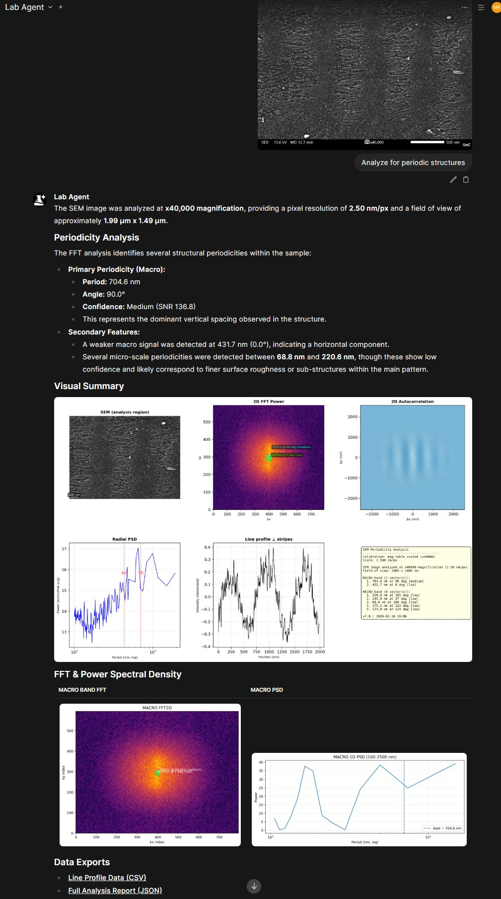

<table>
  <tr>
    <td width="150" align="center">
      
    </td>
    <td>
      <h1>FORTHought</h1>
      <i>A locally hosted AI platform for physics and STEM laboratory workflows.</i>
      <br/><br/>
      <a href="https://github.com/MariosAdamidis/FORTHought/blob/main/LICENSE"></a>
      <a href="#"></a>
      <a href="#"></a>
      <a href="https://arxiv.org/abs/2605.13245"></a>
    </td>
  </tr>
</table>

> **Paper:** M. Adamidis, D. Katrisioti, Y. Tzitzikas, E. Stratakis, *"It's not the Language Model, it's the Tool: Deterministic Mediation for Scientific Workflows"* — [arXiv:2605.13245](https://arxiv.org/abs/2605.13245) (2026). The paper evaluates how typed tool mediation produces identical scientific results across runs while code-generating approaches vary. The [OriginMCP](#originmcp--originlab-automation) and [SEM Micro](#sem-micro--electron-microscopy-fft-analysis) servers in this repository are the tools evaluated in the paper.

---

## What This Is

This repository contains the custom tools, MCP servers, functions, and configuration I built for a locally hosted AI research platform at a physics lab. It runs on [Open WebUI](https://github.com/open-webui/open-webui) and serves 15 active researchers across spectroscopy, electron microscopy, X-ray diffraction, photoluminescence, and general scientific workflows.

**This is not a product.** It is a working research platform that I maintain and iterate on. The tools sit on top of existing open-source projects; my contribution is in how they are assembled, configured, and extended for real lab use. I upload the code here for documentation, reproducibility, and to share with the community.

**Hardware:**

| Server | CPU | GPU | Role |
|---|---|---|---|
| **Compute Server** | AMD Ryzen 9 9950X | 2× AMD Radeon AI Pro R9700 (32 GB VRAM each) | OriginLab, Lemonade reranker, embeddings, VLM, LM Studio, Docling |
| **Docker Server** | Intel Xeon E5-2680 v4 | AMD Radeon RX 7900 XT (20 GB VRAM) | Open WebUI, MCP servers, Jupyter, Qdrant, MetaMCP, all Docker services |

The two machines communicate over Tailscale. The Docker server runs the full containerized stack (35+ containers), while the compute server handles GPU-intensive inference tasks.

> **Configuration note:** All service URLs default to `localhost`. To run your own instance, copy `config/.env.example` to `.env` and fill in your values.

---

## Base Stack

- **LLM inference** via [LM Studio](https://lmstudio.ai/) (local models) and cloud APIs (Gemini via Google research grant, OpenRouter as fallback)
- **Code execution** via a GPU-accelerated Jupyter kernel (ROCm, scientific Python stack)
- **Document parsing** via [Docling](https://github.com/docling-project/docling) (native PyTorch ROCm, with Qwen3-VL for figure descriptions)
- **Vector search** via [Qdrant](https://github.com/qdrant/qdrant) (hybrid BM25 + semantic)
- **Tool orchestration** via [MetaMCP](https://github.com/nicepkg/MetaMCP), aggregating all MCP servers behind a single HTTP endpoint

All services run on-premises. No data leaves the local network unless a cloud LLM is explicitly used.

---

## What I've Built

### RAG Pipeline

Tuned Open WebUI's RAG pipeline for scientific documents. Out-of-the-box defaults struggle with multi-column papers, equations, and dense tables.

| Stage | Configuration | Notes |
|---|---|---|
| **Parsing** | Docling (ROCm GPU) | Granite-Docling + Qwen3-VL for figure descriptions |
| **Embeddings** | Qwen 0.6B embed via LM Studio | Served through a custom parallel proxy that splits batch requests into concurrent sub-batches |
| **Vector store** | Qdrant, hybrid search | 800-token chunks, 100 overlap |
| **Reranking** | BGE-reranker-v2-m3 (GGUF) on 🍋 AMD Lemonade | Shared by RAG and web search |

### Multi-Role Local Models on Lemonade

Each locally hosted model serves multiple roles across the stack:

| Model | Roles | Used by |
|---|---|---|
| **BGE-reranker-v2-m3** (GGUF) | RAG reranking, web search reranking | OWUI Documents pipeline, `web_search.py` tool |
| **Qwen3-Embedding-0.6B** (GGUF) | Document embeddings | OWUI RAG pipeline (via parallel proxy) |
| **Qwen3-VL-30B** (GGUF) | Image descriptions, SEM analysis, general VLM | Docling, `image_description_context` filter, SEM server |

### Free Web Search with Reranking

Custom tool that provides web-augmented answers without expensive search APIs:

- Queries the [LangSearch](https://langsearch.com/) API (free tier, 1000 calls/day)
- Passes results through the same Lemonade reranker used by RAG
- Filters by relevance score, Latin-script ratio, and content length
- Auto-fetches top-scoring pages for full context
- Injects citations into OWUI's native citation UI

See: [`tools/web_search.py`](tools/web_search.py)

### Skill-Gated Tool Routing

Instead of one system prompt stuffed with every tool's documentation, the platform uses per-profile tool surfaces:

| Profile | Use case | Tools it sees |
|---|---|---|
| **Lab** | Literature, reports, web research, chemistry | `paper.*`, `file.*`, `web.*`, `chem.*` |
| **Coder** | Data analysis, plotting, scripting | Jupyter (ROCm), `file.*`, code tools |
| **Instrument** | Spectroscopy, SEM, XRD, PL | `spec.*`, `micro.*`, `xrd.*`, `pl.*` |

Each profile consists of:
1. A **lean system prompt** ([`profiles/`](profiles/)) — routing table only, no tool recipes
2. A **skills file** ([`skills/`](skills/)) — Python OWUI Tool acting as MCP gateway
3. **Skill documents** ([`skill-docs/`](skill-docs/)) — loaded on-demand only when the model actually needs a tool

This keeps token usage low. The model never loads documentation it doesn't need.

---

## Science MCP Servers

These are the MCP tool servers built for the lab's workflows. Each runs as a standalone Python HTTP server implementing the MCP JSON-RPC protocol.

### OriginMCP — OriginLab Automation

**Server:** [`mcp-servers/origin/server.py`](mcp-servers/origin/server.py) (3300+ lines)

Automates OriginPro through its COM API, allowing the model to inspect, analyze, and fit spectroscopy data from OPJ project files. This is the photoluminescence tool evaluated in the [paper](https://arxiv.org/abs/2605.13245).

- Inspect OPJ file structure and column metadata (user-defined parameters: strain, polarization, power)
- Fit peaks: single or two-peak decomposition across Lorentzian, Gaussian, Voigt lineshapes
- Batch fit across N columns with automatic summary grid, waterfall, and trend plots
- Detect degenerate fits (converging peaks) and flag them without crashing
- Infer experimental parameters from column naming conventions when metadata is missing

Runs on Windows (requires OriginPro). Accessible to the Docker stack via Tailscale.

### SEM Micro — Electron Microscopy FFT Analysis

**Server:** [`mcp-servers/micro/server.py`](mcp-servers/micro/server.py)

FFT-based periodicity and particle size analysis for SEM images. This is the scanning electron microscopy tool evaluated in the [paper](https://arxiv.org/abs/2605.13245).

- Reads magnification from the SEM info bar via VLM
- 2D FFT with radial averaging and peak detection
- Reports periodicity (nm), orientation, confidence, and SNR for macro/micro frequency bands
- Particle size distribution (count, mean diameter, std dev, p10–p90)
- 6-panel composite figure output

<p align="center">
  
  <br/>
  <em>FFT periodicity analysis of a LIPSS nanostructure at ×40,000 — automatic magnification detection, 6-panel composite, and data export.</em>
</p>

### XRD Server — X-Ray Diffraction Phase Identification

**Server:** [`mcp-servers/xrd/server.py`](mcp-servers/xrd/server.py)

File-format-agnostic XRD analysis pipeline that identifies crystalline phases from raw diffraction data.

- Parses `.xy`, `.dat`, `.csv`, `.brml` (Bruker XML), and `.raw` (Bruker RAW v4 binary)
- Matches against the Crystallography Open Database (COD) and Materials Project
- Reports confidence scores, Rwp R-factors, purity estimates, impurity detection
- Generates annotated pattern and comparison plots inline
- Exports Origin-ready CSVs

### PL Server — Photoluminescence Experiment Planning

**Server:** [`mcp-servers/pl/server.py`](mcp-servers/pl/server.py)

Laser/filter/optics recommender and Fresnel interference calculator for PL measurements, with specialized support for 2D materials.

- Recommends laser wavelengths, filters, and optical components for any target material
- Calculates excitation and emission enhancement factors for air/SiO₂/Si stacks
- Models signal intensity variation with SiO₂ thickness (PL, Raman, SHG)
- Plans SHG/THG, strain analysis, PLE, imaging mode, and valley polarization experiments
- Built-in materials database (TMDs, perovskites, III-V semiconductors)

### Papers MCP — Literature Search

**Server:** [`mcp-servers/papers/server.py`](mcp-servers/papers/server.py)

Searches and retrieves academic papers from multiple open-access sources.

- Search OpenAlex (250M+ papers, semantic search), PubMed, Semantic Scholar, NASA ADS, CrossRef, OpenAIRE
- Author disambiguation via ORCID
- PDF download from open-access sources (arXiv, OpenAlex, Unpaywall, PMC)
- Batch operations for reference lists

### Files MCP — Document Generation

**Server:** [`mcp-servers/files/`](mcp-servers/files/)

Generates DOCX, PPTX, XLSX, PDF, CSV, HTML, and plain text files from structured data, with default templates.

> 📸 **Screenshots:** See the **[Examples Gallery](docs/EXAMPLES.md)** for OriginMCP batch fitting, literature search, XRD phase ID, PL experiment planning, and more.

---

## Custom Open WebUI Functions

### Pipes

| Function | What it does |
|---|---|
| [`gemini_pipe.py`](pipes/gemini_pipe.py) | Google Gemini pipeline with native tool support and image generation |
| [`openrouter_pipe_v2.py`](pipes/openrouter_pipe_v2.py) | OpenRouter Responses API integration with web search and file uploads |

> **Note:** The pipe files here are reference snapshots. The production pipes have evolved significantly with event-driven streaming, tool-call UI panels, and provider-specific optimizations.

### Filters

| Function | What it does |
|---|---|
| [`markdown_normalizer.py`](filters/markdown_normalizer.py) | Cleans leaked reasoning labels, XML artifacts, and broken formatting from LLM outputs |
| [`image_description_context.py`](filters/image_description_context.py) | Extracts text from images via a vision model so text-only models can process image uploads |
| [`image_reembed_injector.py`](filters/image_reembed_injector.py) | Re-injects uploaded image URLs into context for models that lose them across turns |
| [`uploaded_filename.py`](filters/uploaded_filename.py) | Injects file metadata (IDs, names) so tools can reference uploaded files |

### Tools

| Function | What it does |
|---|---|
| [`web_search.py`](tools/web_search.py) | Free web search with LangSearch API + Lemonade reranking |
| [`chemistry_database.py`](tools/chemistry_database.py) | PubChem and CAS compound lookups (name, formula, safety data) |
| [`chart_server/`](tools/chart_server/) | Server-side Chart.js rendering for inline data visualizations |
| [`presenton_adapter.py`](tools/presenton_adapter.py) | MCP bridge to Presenton for AI-generated slide decks |

### Actions

| Function | What it does |
|---|---|
| [`export_to_word.py`](actions/export_to_word.py) | Export conversations to formatted Word documents with APA 7th styling |
| [`lemonade_control_panel.py`](actions/lemonade_control_panel.py) | Visual dashboard for monitoring the AMD Lemonade Server |

---

## Architecture

```
┌─── Docker Server (Xeon E5-2680v4 + RX 7900 XT) ────────────┐
│                                                               │
│  Open WebUI (:8081)                                           │
│      │                                                        │
│      ├── Gemini Pipeline (primary LLM)                        │
│      ├── OpenRouter Pipe (fallback models)                    │
│      │                                                        │
│      ├── Qdrant (:6333) ── hybrid vector search               │
│      ├── Jupyter (:8888) ── code execution (ROCm)             │
│      │                                                        │
│      └── MetaMCP (:12008)                                     │
│          ├── Papers    (:9005)   ├── Chemistry (OWUI tool)    │
│          ├── Files     (:9004)   ├── XRD       (:9008)        │
│          ├── SEM/Micro (:9006)   ├── PL        (:9010)        │
│          └── Context7, Presenton, Browser                     │
│                                                               │
└──────────────── Tailscale ───────────────────────────────────┘
                      │
┌─── Compute Server (Ryzen 9950X + 2× R9700 64 GB) ───────────┐
│                                                               │
│  LM Studio (:1234) ── local LLMs, VLM (Qwen3-VL)             │
│  Lemonade Server (:8040) ── BGE-reranker-v2-m3-GGUF           │
│  Embedding Proxy (:5555) ── Qwen 0.6B embed                   │
│  Docling (:5001-5003) ── document parsing (ROCm)              │
│  OriginMCP (:12009) ── OriginLab COM automation (Windows)     │
│                                                               │
└───────────────────────────────────────────────────────────────┘
```

---

## Repository Structure

```
FORTHought/
├── README.md
├── CITATION.cff
├── LICENSE
├── .gitignore
│
├── mcp-servers/                     # MCP tool servers
│   ├── papers/server.py             #   Literature search & download
│   ├── origin/server.py             #   OriginLab COM automation
│   ├── micro/server.py              #   SEM FFT periodicity analysis
│   ├── xrd/server.py                #   XRD phase identification
│   ├── pl/server.py                 #   PL experiment planning
│   └── files/                       #   Document generation (DOCX, PPTX, etc.)
│
├── pipes/                           # LLM provider integrations (reference snapshots)
│   ├── gemini_pipe.py               #   Google Gemini pipeline
│   └── openrouter_pipe_v2.py        #   OpenRouter Responses API
│
├── filters/                         # Input/output processing
│   ├── markdown_normalizer.py
│   ├── image_description_context.py
│   ├── image_reembed_injector.py
│   └── uploaded_filename.py
│
├── tools/                           # OWUI tool functions
│   ├── web_search.py
│   ├── chemistry_database.py
│   ├── chart_server/
│   └── presenton_adapter.py
│
├── actions/                         # Chat action buttons
│   ├── export_to_word.py
│   └── lemonade_control_panel.py
│
├── skills/                          # MCP gateway + routing logic
│   ├── lab_skills.py
│   ├── coder_skills.py
│   └── instrument_skills.py
│
├── skill-docs/                      # On-demand tool documentation
│   ├── instruments/{origin,sem,xrd}/
│   ├── research/{academic-search,literature,web-search}/
│   ├── documents/{file-export,presenton}/
│   ├── compute/code-interpreter/
│   └── visualization/chartjs/
│
├── profiles/                        # System prompt templates
│   ├── lab_prompt.md
│   ├── coder_prompt.md
│   └── instrument_prompt.md
│
├── config/
│   ├── docker-compose.yml
│   ├── .env.example
│   └── Dockerfile.*
│
├── docs/
│   ├── SETUP.md
│   └── EXAMPLES.md
│
├── scripts/
│   ├── fileserver_app.py
│   └── smoke_test_core.sh
│
└── assets/
    ├── forthought-logo.png
    └── screenshots/
```

---

## Getting Started

1. **Clone:**
   ```bash
   git clone https://github.com/MariosAdamidis/FORTHought.git
   cd FORTHought
   ```

2. **Configure:**
   ```bash
   cp config/.env.example .env
   # Edit .env with your API keys and service URLs
   ```

3. **Start:**
   ```bash
   docker compose -f config/docker-compose.yml up -d
   ```

4. **Set up Open WebUI:** See **[docs/SETUP.md](docs/SETUP.md)** for importing functions, creating model profiles, configuring RAG, code execution, and MetaMCP wiring.

5. **Verify:**
   ```bash
   bash scripts/smoke_test_core.sh
   ```

---

## Roadmap

### Done
- [x] HTTP-persistent MCP transport
- [x] Skill-gated multi-profile routing
- [x] OriginMCP: batch fitting, waterfall/trend plots, degenerate fit detection
- [x] XRD pipeline with COD/MP matching and Origin export
- [x] PL substrate enhancement and experiment planning server
- [x] Chemistry database integration
- [x] AMD Lemonade reranker (dual: RAG + web search)
- [x] Free web search tool with reranking
- [x] Parallel embedding proxy
- [x] Docling GPU acceleration on ROCm with Qwen3-VL
- [x] Markdown normalizer for output cleanup
- [x] Typed mediation pattern evaluated across 4 platforms ([paper](https://arxiv.org/abs/2605.13245))
- [x] Open WebUI 0.9.5 with custom patches
- [x] Event-driven tool-call UI panels in production pipes

### Next
- [ ] Additional OWUI tools to be open-sourced (interactive question UI, inline visuals, computer use)
- [ ] Browser-use VLM automation for instrument control
- [ ] N-peak fitting (defect emission, phonon replicas)
- [ ] Raman peak database
- [ ] PLE contour plots
- [ ] Full-loop: plan → measure → analyze → report

---

## Security

This platform is designed for local/private-network deployment. Do not expose services directly to the public internet. See [SECURITY.md](SECURITY.md) for details.

The papers server in this repository is configured for open-access sources only. If you need institutional access, configure that through your own environment and credentials.

---

## Acknowledgements

Built on top of open-source projects and community contributions.

### Core Platform

- [Open WebUI](https://github.com/open-webui/open-webui) — Chat interface
- [AMD Lemonade](https://github.com/lemonade-sdk/lemonade) — Local reranker serving on AMD hardware
- [Docling](https://github.com/docling-project/docling) — Document parsing
- [Qdrant](https://github.com/qdrant/qdrant) — Vector database
- [LM Studio](https://lmstudio.ai/) — Local model serving
- [MetaMCP](https://github.com/nicepkg/MetaMCP) — MCP server orchestration
- [Crystallography Open Database](https://www.crystallography.net/) — XRD reference patterns
- [Materials Project](https://github.com/materialsproject) — Materials science database
- [LangSearch](https://langsearch.com/) — Free web search API

### Community Functions (adapted for FORTHought)

Several Open WebUI functions in this repository are adapted from community work. Original authors are credited in each file header.

| Function | Original Author | What I adapted |
|---|---|---|
| Gemini Pipeline | [owndev](https://openwebui.com/u/owndev), [olivier-lacroix](https://openwebui.com/u/olivier-lacroix) | Token optimization, tool integration, image generation |
| OpenRouter Pipe | [rbb-dev](https://openwebui.com/u/rbb-dev) | Integration with MetaMCP and file server |
| Export to Word | [Fu-Jie](https://openwebui.com/u/Fu-Jie) | APA 7th Edition styling, Greek/English i18n |
| Markdown Normalizer | [Fu-Jie](https://openwebui.com/u/Fu-Jie) | Custom rules for scientific output cleanup |
| Image Description Context | [inMorphis](https://openwebui.com/u/inMorphis) | Adapted for multi-model routing |
| Files Metadata Injector | [GlissemanTV](https://openwebui.com/u/GlissemanTV) | Integration with file server pipeline |
| Lemonade Control Panel | [Sawan Srivastava](https://openwebui.com/u/sawan-srivastava) | Integrated into Lemonade deployment |

### Community Contributors

- **r/LocalLLaMA** contributor **Ok_Ocelot2268** — ROCm patches for Unsloth
- **@mballesterosc** (Open WebUI community) — File Path Injector concept

---

## Citation

If you use ideas or code from FORTHought, please cite:

```bibtex
@misc{adamidis2026forthought,
  author = {Adamidis, Marios and Katrisioti, Danae and Tzitzikas, Yannis and Stratakis, Emmanuel},
  title  = {It's not the Language Model, it's the Tool: Deterministic Mediation for Scientific Workflows},
  year   = {2026},
  eprint = {2605.13245},
  archivePrefix = {arXiv},
  primaryClass  = {cs.AI}
}
```

---

## License

MIT License. See [LICENSE](LICENSE) for details.
