# FORTHought — Examples Gallery

Screenshots from real lab workflows running on the FORTHought platform.

---

## OriginMCP — Batch Spectroscopy Analysis

  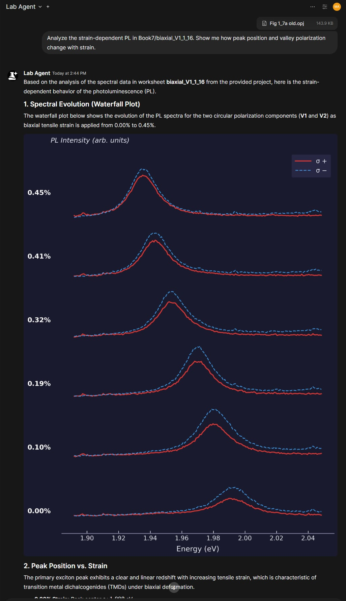
   
  <em>Strain-dependent PL waterfall plot generated by OriginMCP from an OPJ file — σ+ and σ− circular polarization components across 6 biaxial strain levels.</em>

  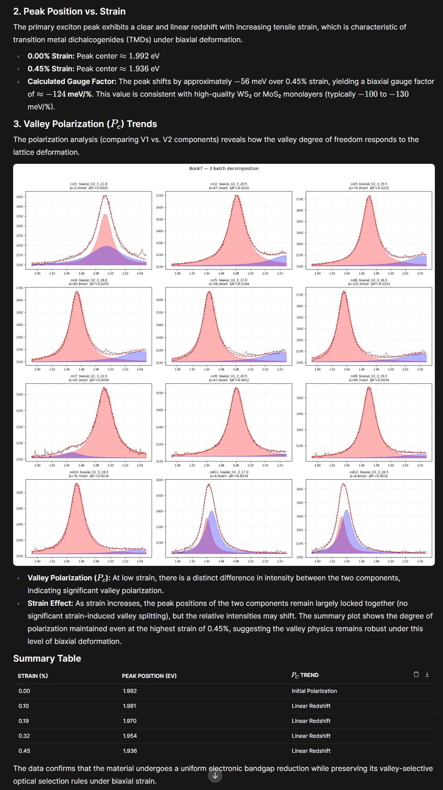
   
  <em>Batch two-peak decomposition across 12 columns with automatic summary table, peak position vs. strain trend, and valley polarization analysis.</em>

---

## Papers MCP — Literature Search & Download

  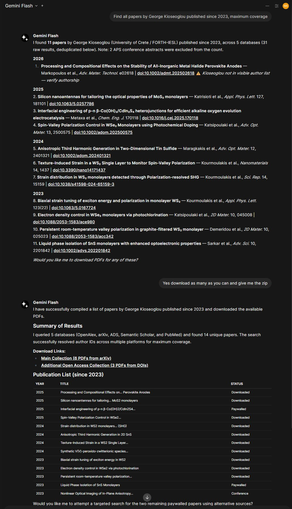
   
  <em>Author publication search with automatic PDF download across 5 databases — resolved via ORCID for exhaustive coverage.</em>

  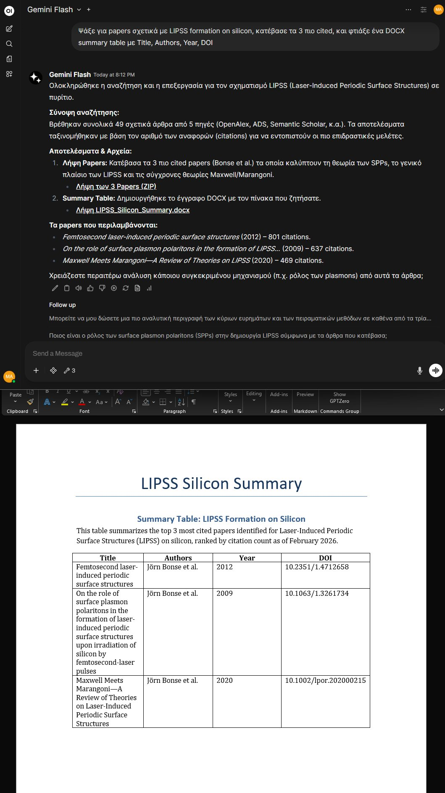
   
  <em>Literature search with PDF download and DOCX summary table export — responding in Greek when prompted in Greek.</em>

---

## XRD — Phase Identification

  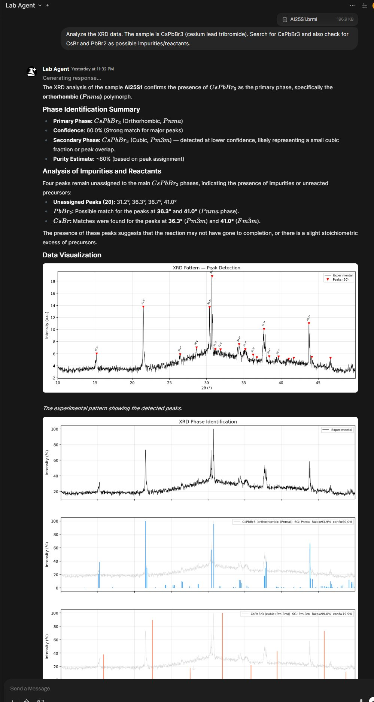
   
  <em>XRD phase identification of CsPbBr₃ from a Bruker .brml file — peak detection, COD/MP matching with Rwp scores, and impurity analysis for PbBr₂ and CsBr precursors.</em>

---

## SEM — FFT Periodicity Analysis

  
   
  <em>FFT periodicity analysis of a LIPSS nanostructure SEM image at ×40,000 — automatic magnification detection, 6-panel composite, and CSV/JSON data export.</em>

---

## PL Server — Experiment Planning & Analysis

  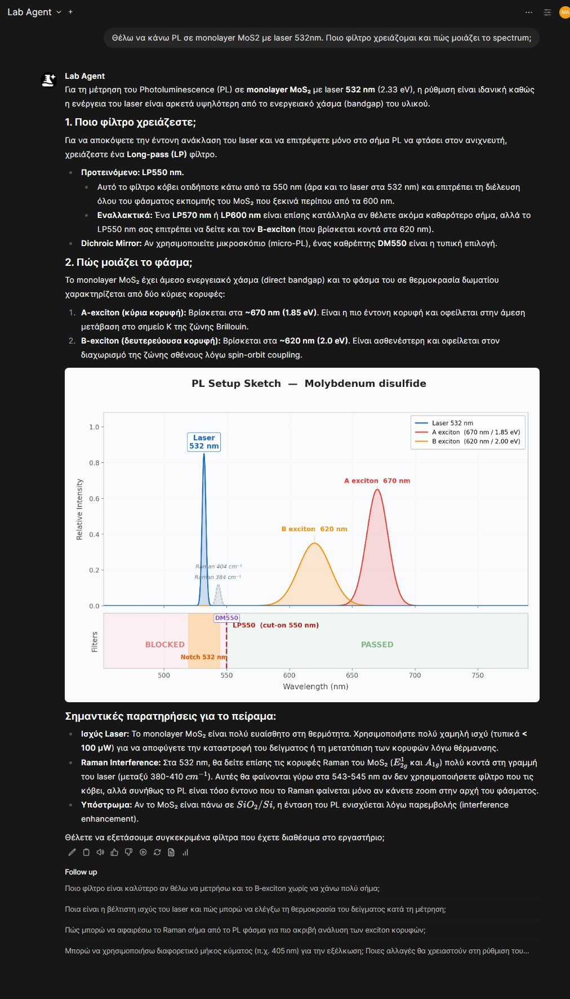
   
  <em>PL experiment planning — laser/filter recommendation with annotated setup sketch showing excitation, emission peaks, Raman modes, and filter chain for MoS₂.</em>

  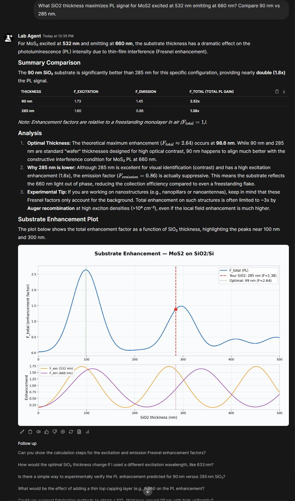
   
  <em>Fresnel interference calculation comparing 90 nm vs 285 nm SiO₂ substrates for MoS₂ PL at 532 nm excitation.</em>

  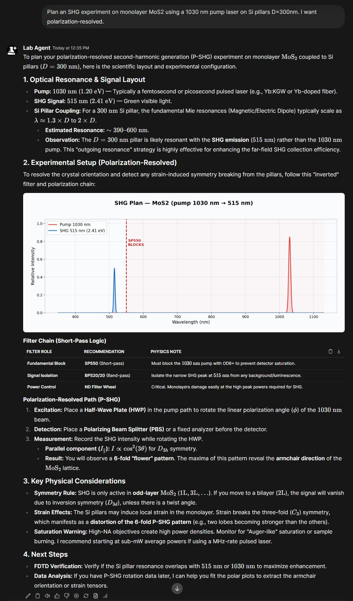
   
  <em>SHG experiment planning with filter chain, polarization-resolved setup, and spectral diagram.</em>

  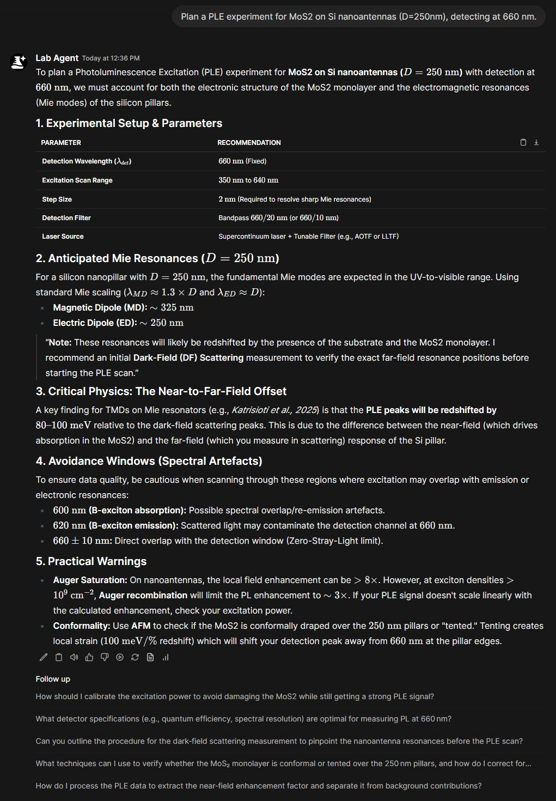
   
  <em>PLE experiment planning for MoS₂ on Si nanoantennas — Mie resonance prediction, spectral artefact avoidance, and practical warnings.</em>

  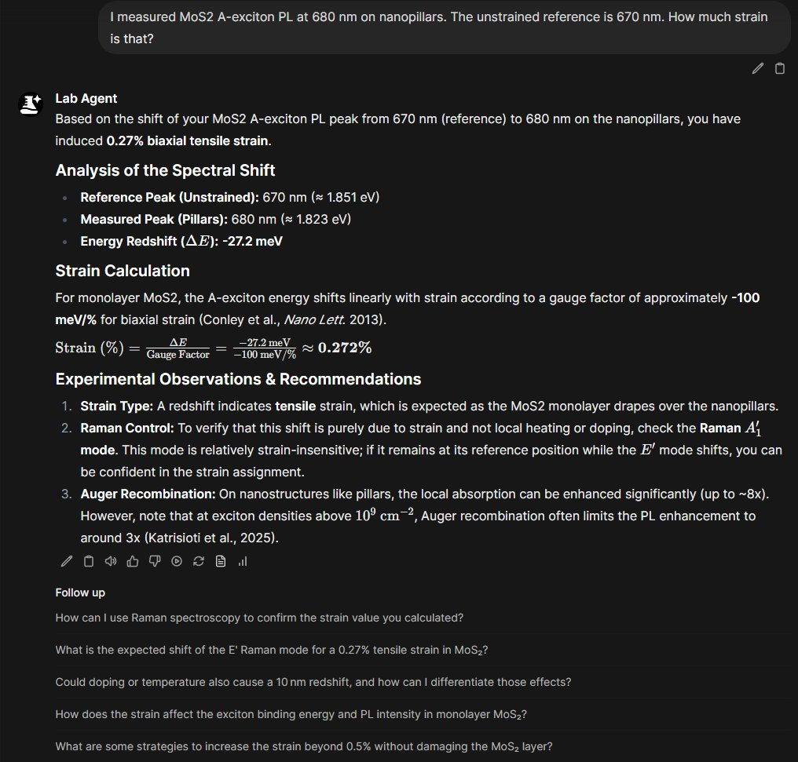
   
  <em>Strain calculation from a measured PL peak shift — with gauge factor, Raman cross-check recommendation, and Auger recombination warning.</em>

  
   
  <em>Valley polarization measurement protocol for photochlorinated WSe₂ at 78K — complete optics chain, expected P_c values, and precision checklist.</em>

  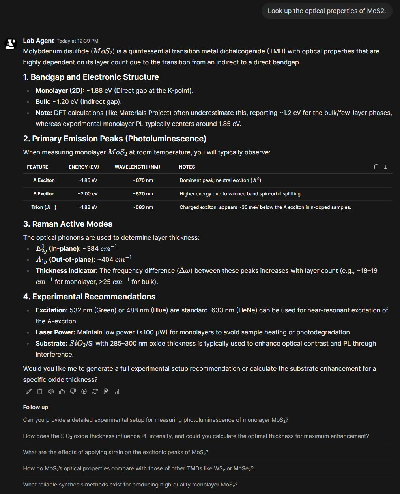
   
  <em>Materials database lookup — optical properties, emission peaks, Raman modes, and experimental recommendations for MoS₂.</em>

  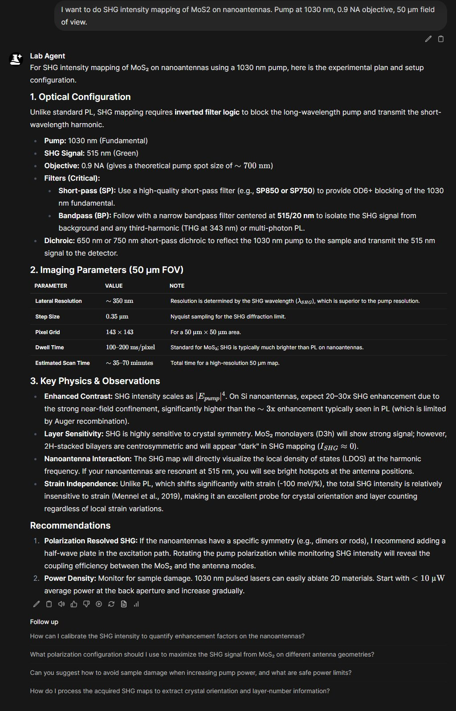
   
  <em>SHG intensity mapping plan with imaging parameters, physics considerations, and near-field enhancement predictions.</em>

---

## Skill-Gated Routing

  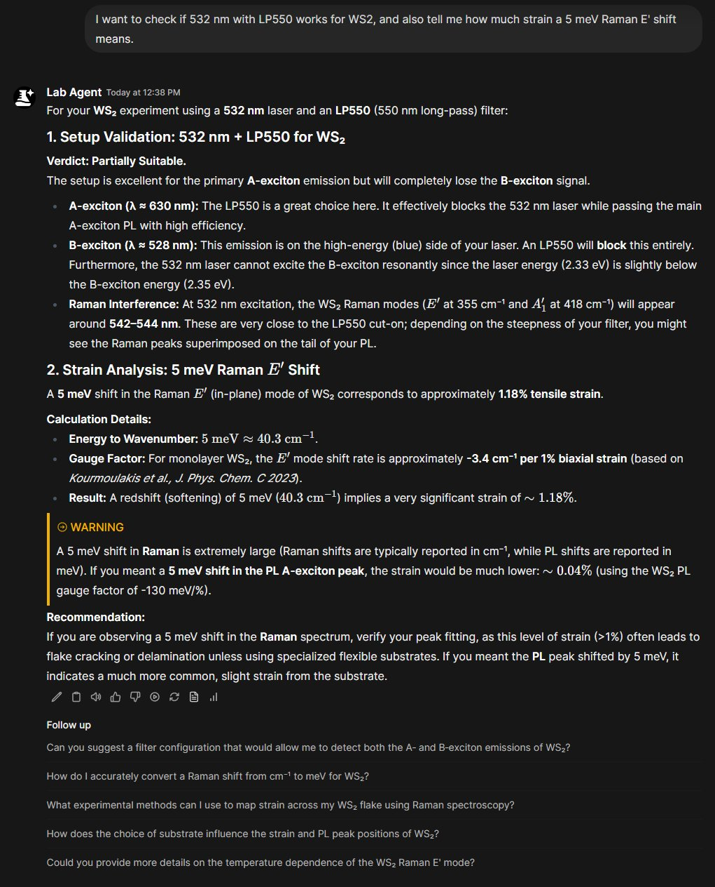
   
  <em>Skill-gated routing in action — the LLM loads only the tool documentation it needs for the current request.</em>

---

## AMD Lemonade Server

  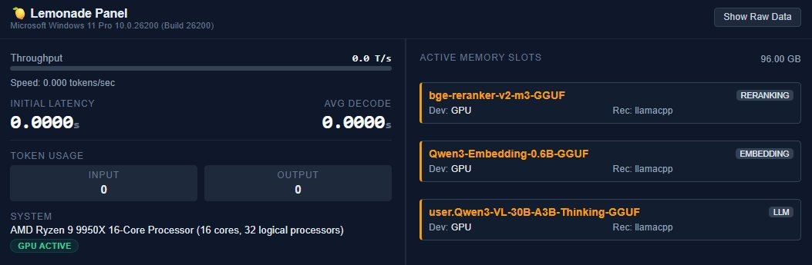
   
  <em>AMD Lemonade Server dashboard (via the OWUI action) — showing all three models loaded on GPU with the Ryzen 9 9950X system.</em>

